# Attack Chain 1 — "The Network Hands Over the Portal"
## Project KAVACH · Meridian FinServe Pvt. Ltd.

**Classification:** Engagement Confidential  
**Workstream:** C — Synthesis (feeds from WS-A and WS-B)  
**Chain Direction:** Workstream A → Workstream B  
**Date:** June 2026

---

## What This Chain Shows

> This chain starts on the **network layer (Workstream A)** and crosses into the **web application layer (Workstream B)**.  
> The attacker enters through a phishing email, steals credentials from the internal network, and uses them to take over the customer portal — downloading 1,80,000 borrower records without triggering a single alert.

**The surface crossing happens between Stage 3 and Stage 4.**  
Everything before that line is a network event.  
Everything after it is a web application event.  
The exfiltration in Stage 6 becomes visible again at the network layer — closing the loop.

---

## Surface Direction — At a Glance

```
WS-A  ──────────────────────────────►  WS-B  ──────────────►  WS-A
      NETWORK                              WEB                  NETWORK
      Stage 1 → Stage 2 → Stage 3    Stage 4 → Stage 5    Stage 6
      Initial    Credential  Lateral   Portal     Data        Exfil
      Access     Theft       Movement  Takeover   Collection  Visible
```

The arrow above tells the whole story.  
The attacker lives in the network for the first three stages.  
They cross into the web application at Stage 4.  
The damage done in the web layer shows up back on the network at Stage 6.

---

## Chain 1 — Full Mermaid Flow Diagram

The diagram below shows all six stages, which workstream each stage belongs to, the STRIDE category at each step, and the direction of the surface crossing. The thick border around the cross-surface arrow marks exactly where WS-A hands over to WS-B.

```mermaid
%%{init: {'theme': 'base', 'themeVariables': {'primaryColor': '#fdf6ec', 'primaryBorderColor': '#c9956b', 'primaryTextColor': '#3d2b1f', 'lineColor': '#8b6f5e', 'secondaryColor': '#f0e8d8', 'tertiaryColor': '#fdf6ec', 'background': '#fdf6ec', 'mainBkg': '#fdf6ec', 'nodeBorder': '#c9956b', 'clusterBkg': '#fef9f3', 'clusterBorder': '#c9956b', 'edgeLabelBackground': '#fdf6ec'}}}%%

flowchart TD

    ATK([" External Attacker "])

    subgraph WSA["WORKSTREAM A — Network Surface"]
        direction TB
        S1["STAGE 1 · Initial Access\n─────────────────────────\nPhishing email → Trickbot on\nbranch workstation\nRuns in memory · No disk artefact\nC2 beacon every ~202 seconds\nto 37.228.70.134\n─────────────────────────\nSTRIDE: Spoofing T-12\nATT&CK: T1566 · T1059"]

        S2["STAGE 2 · Credential Theft\n─────────────────────────\nCobalt Strike reads LSASS memory\nPCAP frame 10799\nCaptures:\n· Domain employee credential\n· Portal service account hash\n─────────────────────────\nSTRIDE: Info Disclosure T-10\nATT&CK: T1003.001 · T1555"]

        S3["STAGE 3 · Lateral Movement\n─────────────────────────\nPass-the-Hash from workstation\nto Application Server\n1.79 MB SMB session confirmed\nEast-west traffic SOC saw\nbut could not explain\n─────────────────────────\nSTRIDE: Elevation of Privilege T-17\nATT&CK: T1550.002 · T1021"]
    end

    CROSS{{"⚡ SURFACE CROSSING\nWS-A → WS-B\nStolen credential used\nto log into portal\nNo MFA · No alert"}}

    subgraph WSB["WORKSTREAM B — Web Application Surface"]
        direction TB
        S4["STAGE 4 · Portal Account Takeover\n─────────────────────────\nStolen service account credential\nused on customer portal admin\nNo MFA configured\nNo alert fired\nAttacker = portal admin\n─────────────────────────\nSTRIDE: Spoofing T-01 · T-08\nATT&CK: T1078 · T1190"]

        S5["STAGE 5 · Data Collection via IDOR\n─────────────────────────\nAttacker iterates:\nGET /api/statements/1\nGET /api/statements/2 ...\nGET /api/statements/180000\nAll 1,80,000 records downloaded\nNo rate limit · No alert\n─────────────────────────\nSTRIDE: Info Disclosure T-05\nATT&CK: T1213"]
    end

    LOOP{{"↩ BACK TO NETWORK LAYER\nExfiltration volume anomaly\nvisible in PCAP\nSame signal as Trigger A\nOne event · Two surfaces"}}

    S6["STAGE 6 · Exfiltration Visible at Network\n─────────────────────────\nBulk download = large outbound HTTP\nPCAP shows volume spike\nfrom server segment\nSame class of anomaly that\nflagged Trigger A\n─────────────────────────\nSTRIDE: Info Disclosure T-04 · T-05\nATT&CK: T1041"]

    IMPACT(["IMPACT\n1,80,000 borrower records exfiltrated\nRBI regulatory breach\nNo alert at any stage\nAttacker still active at capture end"])

    ATK --> S1
    S1 --> S2
    S2 --> S3
    S3 --> CROSS
    CROSS --> S4
    S4 --> S5
    S5 --> LOOP
    LOOP --> S6
    S6 --> IMPACT
```



---

## Stage-by-Stage Breakdown

### Stage 1 — Initial Access
**Surface: Workstream A (Network)**

A phishing email lands on a branch office workstation. The attached file drops Trickbot, which executes entirely in memory — nothing is written to disk, which is why standard antivirus tools find nothing. Within minutes of execution, Trickbot establishes a command-and-control channel back to the attacker's server at `37.228.70.134` over HTTPS, beaconing every approximately 202 seconds.

The SOC notices anomalous outbound traffic from the server segment during this 72-hour window — this is **Trigger A**. They cannot identify the source or purpose. The investigation stalls.

| Field | Detail |
|-------|--------|
| Surface | WS-A — Network |
| STRIDE | Spoofing (T-12) — beacon disguised as legitimate HTTPS |
| ATT&CK | T1566 Phishing → T1059 Scripted Execution |
| Evidence | PCAP — 28 TLS ClientHellos to 37.228.70.134, no SNI, ~202s interval |
| Gap Exploited | No egress filter on server segment (TB-05) |

---

### Stage 2 — Credential Theft
**Surface: Workstream A (Network)**

Cobalt Strike — delivered by Trickbot as a second-stage payload — reads the LSASS memory process on the compromised workstation. LSASS is the Windows process that holds active authentication credentials in memory. Reading it is quiet, fast, and leaves no obvious log entry.

At PCAP frame 10799 the credential harvest is complete. Two things are captured: the domain employee's credential (which has portal admin access), and the portal service account hash (saved in the browser's credential store).

| Field | Detail |
|-------|--------|
| Surface | WS-A — Network |
| STRIDE | Information Disclosure (T-10) |
| ATT&CK | T1003.001 LSASS Dump → T1555 Credentials from Stores |
| Evidence | PCAP frame 10799 — LSASS access confirmed |
| Gap Exploited | No EDR on endpoints, no Credential Guard |

---

### Stage 3 — Lateral Movement
**Surface: Workstream A (Network)**

Using the stolen domain credential with a Pass-the-Hash technique — which means the attacker does not need to know the actual password, only the hash — the attacker moves from the infected branch workstation to the Application Server that hosts the customer portal.

This generates a 1.79 MB SMB session visible in the PCAP. This is the east-west server-segment traffic the SOC observed but could not attribute. There was no baseline for what normal server-segment traffic looked like, so the anomaly had nothing to be measured against.

| Field | Detail |
|-------|--------|
| Surface | WS-A — Network |
| STRIDE | Elevation of Privilege (T-17) |
| ATT&CK | T1550.002 Pass-the-Hash → T1021 Remote Services |
| Evidence | PCAP frame 10799 — 1.79 MB SMB session, workstation to app server |
| Gap Exploited | No east-west firewall, no jump host, flat /24 subnet |

---

> ## ⚡ SURFACE CROSSING — WS-A → WS-B
>
> **This is where the network attack becomes a web application attack.**
>
> The credential stolen from the network layer (WS-A) is now used to authenticate directly into the customer portal (WS-B). The attacker does not need to exploit a web vulnerability to get in — they already have a valid credential. The stolen network credential is the web application key.
>
> **Everything above this line is a network event.**  
> **Everything below this line is a web application event.**

---

### Stage 4 — Portal Account Takeover
**Surface: Workstream B (Web)**

The stolen portal service account credential is used to log directly into the customer portal's administrative interface. No MFA is configured on this account. The login succeeds. No alert fires.

The attacker is now authenticated as a portal administrator — with full read access to every borrower's records, every loan history, every EMI schedule.

| Field | Detail |
|-------|--------|
| Surface | WS-B — Web Application |
| STRIDE | Spoofing (T-01, T-08) |
| ATT&CK | T1078 Valid Accounts → T1190 Exploit Public-Facing App |
| Evidence | No MFA confirmed in WS-B assessment; session not rotated post-login |
| Gap Exploited | No MFA on admin accounts (A07 Authentication Failure) |

---

### Stage 5 — Data Collection via IDOR
**Surface: Workstream B (Web)**

Logged in as admin, the attacker uses the IDOR vulnerability on the account-statements endpoint. The endpoint takes an integer in the URL and returns the corresponding borrower's full financial record. The attacker iterates from 1 to 180,000.

```
GET /api/statements/1      → Borrower 1 record returned
GET /api/statements/2      → Borrower 2 record returned
...
GET /api/statements/180000 → Borrower 180,000 record returned
```

No rate limit exists. No anomaly detection fires. All 1,80,000 records — names, account numbers, loan amounts, EMI schedules, contact details — are downloaded in bulk.

| Field | Detail |
|-------|--------|
| Surface | WS-B — Web Application |
| STRIDE | Information Disclosure (T-05) |
| ATT&CK | T1213 Data from Information Repositories |
| Evidence | IDOR confirmed in WS-B; sequential integer IDs on statements API |
| Gap Exploited | No object-level authorisation, no rate limiting (A01 Broken Access Control) |

---

> ## ↩ BACK TO NETWORK LAYER
>
> **The damage done on the web layer now becomes visible on the network layer.**
>
> The bulk download of 1,80,000 records produces a large volume of outbound HTTP traffic. This appears in the PCAP as an anomalous data transfer from the server segment — the same type of signal the SOC flagged in Trigger A. The network anomaly and the web attack are the same event, seen from two different vantage points.

---

### Stage 6 — Exfiltration Visible at Network Layer
**Surface: Workstream A (Network) — Loop Closed**

The bulk record download produces large outbound HTTP payloads from the server segment. This volume spike is visible in the PCAP and matches the class of anomaly that originally triggered the engagement. The SOC had been watching the right thing — they just did not know what was generating it.

At this stage the attacker has everything. 1,80,000 records. No alert fired. The Cobalt Strike beacon is still active. The capture window ends with the attacker still present.

| Field | Detail |
|-------|--------|
| Surface | WS-A — Network (loop back) |
| STRIDE | Information Disclosure (T-04, T-05) |
| ATT&CK | T1041 Exfiltration Over C2 Channel |
| Evidence | PCAP — volume anomaly from server segment matching Trigger A profile |
| Gap Exploited | No DLP, no volume baseline alerting on outbound traffic |

---

## Chain Summary Table

| Stage | Name | Surface | Workstream | STRIDE | ATT&CK | Key Gap |
|-------|------|---------|------------|--------|--------|---------|
| 1 | Initial Access | Network | **WS-A** | Spoofing | T1566, T1059 | No egress filter |
| 2 | Credential Theft | Network | **WS-A** | Info Disclosure | T1003.001, T1555 | No EDR, no Credential Guard |
| 3 | Lateral Movement | Network | **WS-A** | Elevation of Privilege | T1550.002, T1021 | Flat subnet, no jump host |
| ⚡ | **SURFACE CROSSING** | **WS-A → WS-B** | **Both** | — | — | **No MFA on portal** |
| 4 | Portal Takeover | Web | **WS-B** | Spoofing | T1078, T1190 | No MFA (A07) |
| 5 | Data Collection | Web | **WS-B** | Info Disclosure | T1213 | No authZ, no rate limit (A01) |
| ↩ | **BACK TO NETWORK** | **WS-B → WS-A** | **Both** | — | — | **No DLP, no volume alert** |
| 6 | Exfiltration | Network | **WS-A** | Info Disclosure | T1041 | No baseline alerting |

---

## What Controls Break This Chain

Each control below targets a specific stage. Breaking any one of them stops the chain at that point.

| Stage Targeted | Control | Why It Works |
|---------------|---------|-------------|
| Stage 1 | Egress filter on server segment | Blocks the C2 beacon before it can establish; attacker has no way to send commands |
| Stage 2 | EDR with memory protection + Credential Guard | Prevents LSASS reading; credential harvest never happens |
| Stage 3 | East-west firewall + jump host | Workstation cannot reach app server directly; lateral movement path closed |
| Stage 4 | MFA on all portal accounts | Stolen credential alone is not enough; takeover fails |
| Stage 5 | Object-level authorisation on statements API | Each request validated against session owner; IDOR returns nothing |
| Stage 6 | Volume baseline alert on outbound traffic | 1,80,000 record download triggers alert; investigation begins |

**Break any one of these six controls and this chain does not complete.**  
The highest-leverage single control is MFA at Stage 4 — it sits exactly at the surface crossing and stops the web phase before it starts.

---

## Business Impact

| Category | Detail |
|----------|--------|
| Records exposed | 1,80,000 borrower records — names, accounts, loan amounts, EMI schedules |
| Detection | Zero alerts fired at any stage |
| Regulatory | RBI IT Framework breach — notification obligation triggered |
| Reputational | Full customer financial history in attacker's hands |
| Financial | Loan data usable for fraud, account takeover, targeted phishing at scale |
| Status at capture end | Attacker still active — C2 beacon still running |

---

*Attack Chain 1 of 2 · Project KAVACH — Workstream C Synthesis · Engagement Confidential*  
*Chain 2 — "The Portal Hands Over the Network" (WS-B → WS-A) documented separately.*
