# Attack Chain 2 — "The Portal Hands Over the Network"
## Project KAVACH · Meridian FinServe Pvt. Ltd.

**Classification:** Engagement Confidential  
**Workstream:** C — Synthesis (feeds from WS-A and WS-B)  
**Chain Direction:** Workstream B → Workstream A  
**Date:** June 2026

---

## What This Chain Shows

> This chain starts on the **web application layer (Workstream B)** and crosses into the **network layer (Workstream A)**.  
> The attacker enters through a SQL injection vulnerability on the public-facing customer portal, extracts database credentials, connects directly to the internal database server, escalates to operating system level access, and deploys Cobalt Strike — which then becomes visible in the PCAP as the anomalous outbound traffic the SOC flagged in Trigger A.

**The surface crossing happens between Stage 2 and Stage 3.**  
Everything before that line is a web application event.  
Everything after it is a network event.  
The final stage reaches the domain controller — giving the attacker control of every system in the organisation.

---

## Surface Direction — At a Glance

```
WS-B  ──────────────────────────►  WS-A  ──────────────────────────────────────►
      WEB                              NETWORK
      Stage 1 → Stage 2          Stage 3 → Stage 4 → Stage 5 → Stage 6
      Initial    DB Credential    Direct    OS          Cobalt     Network-wide
      Access     Extraction       DB Access Command     Strike     Lateral
                                           Execution    Deploy     Movement
```

The arrow above tells the whole story.  
The attacker lives in the web application for the first two stages.  
They cross into the internal network at Stage 3 using credentials stolen from the web layer.  
From that point, every subsequent move is a network event — and eventually it is exactly what the SOC saw in Trigger A.

---

## Chain 2 — Full Mermaid Flow Diagram

The diagram below shows all six stages, which workstream each stage belongs to, the STRIDE category at each step, and the direction of the surface crossing. The diamond nodes mark exactly where WS-B hands over to WS-A and where full network control is reached.

```mermaid
%%{init: {'theme': 'base', 'themeVariables': {'primaryColor': '#fdf6ec', 'primaryBorderColor': '#c9956b', 'primaryTextColor': '#3d2b1f', 'lineColor': '#8b6f5e', 'secondaryColor': '#f0e8d8', 'tertiaryColor': '#fdf6ec', 'background': '#fdf6ec', 'mainBkg': '#fdf6ec', 'nodeBorder': '#c9956b', 'clusterBkg': '#fef9f3', 'clusterBorder': '#c9956b', 'edgeLabelBackground': '#fdf6ec'}}}%%

flowchart TD

    ATK([" External Attacker\nPublic Internet "])

    subgraph WSB["WORKSTREAM B — Web Application Surface"]
        direction TB
        S1["STAGE 1 · Initial Access\n─────────────────────────\nSQL injection on portal login page\nTiming-based blind SQLi confirmed\nVerbose error messages return:\n· DB version — MariaDB 10.1.26\n· Internal hostname exposed\n─────────────────────────\nSTRIDE: Info Disclosure T-04\nATT&CK: T1190"]

        S2["STAGE 2 · DB Credential Extraction\n─────────────────────────\nSQLi UNION attack reads\nweb.config / app config file\nExtracts:\n· Host: dbsvr01.meridian.internal\n· Account: svc_portal_db\n· Password: in plaintext\n─────────────────────────\nSTRIDE: Info Disclosure T-08\nATT&CK: T1555"]
    end

    CROSS{{"⚡ SURFACE CROSSING\nWS-B → WS-A\nWeb credential used to open\ndirect TCP connection\nto internal DB server port 1433\nNo ingress filter — nothing blocked it"}}

    subgraph WSA["WORKSTREAM A — Network Surface"]
        direction TB
        S3["STAGE 3 · Direct Database Access\n─────────────────────────\nAttacker connects from external VPS\ndirectly to DB server port 1433\nAppears in PCAP as anomalous\nearst-west traffic from\nunexpected external source IP\n─────────────────────────\nSTRIDE: Spoofing T-08\nATT&CK: T1078 · T1021.002"]

        S4["STAGE 4 · OS Command Execution\n─────────────────────────\nDB service account = sysadmin\nAttacker enables xp_cmdshell:\nxp_cmdshell 'whoami'\n→ nt authority\\system\nOS-level access on DB server\nreached from a web vulnerability\n─────────────────────────\nSTRIDE: Elevation of Privilege T-11\nATT&CK: T1505.001 · T1068"]

        S5["STAGE 5 · Cobalt Strike Deployed\n─────────────────────────\nVia xp_cmdshell, attacker runs:\ncertutil.exe downloads CS Beacon\nDB server begins beaconing HTTPS\nto attacker C2 server\nThis IS Trigger A — the anomalous\noutbound traffic the SOC saw\n─────────────────────────\nSTRIDE: Spoofing T-12\nATT&CK: T1105 · T1071.001"]

        S6["STAGE 6 · Network-Wide Lateral Movement\n─────────────────────────\nDB server = Cobalt Strike pivot\nPass-the-Hash → Domain Controller\nDCSync pulls all password hashes\nDomain Admin obtained\nAll 9 branch offices accessible\nBoth data centres accessible\nHosted workloads accessible\n─────────────────────────\nSTRIDE: Elevation of Privilege T-17 · T-18\nATT&CK: T1550.002 · T1003.006"]
    end

    IMPACT(["IMPACT\nFull internal network compromised\nDomain Admin obtained\nAll borrower + merchant data accessible\nRansomware deployment possible\nFraudulent loan disbursement possible\nHosted pipeline accessible for persistence\nC2 beacon matching Trigger A still running"])

    ATK --> S1
    S1 --> S2
    S2 --> CROSS
    CROSS --> S3
    S3 --> S4
    S4 --> S5
    S5 --> S6
    S6 --> IMPACT
```



---

## Stage-by-Stage Breakdown

### Stage 1 — Initial Access
**Surface: Workstream B (Web)**

The attacker finds the SQL injection point on the customer portal login page — the same endpoint the bug-bounty researcher flagged in Trigger B. Using timing-based blind SQL injection, they confirm the database engine is Microsoft SQL Server. The portal responds with verbose error messages that expose the internal database version and hostname fragments — information that should never leave the server.

This is entirely a web-layer event. No network detection tool would catch this at this stage. The only thing that would have stopped it is a web application firewall with SQL metacharacter rules, or parameterised queries in the application code.

| Field | Detail |
|-------|--------|
| Surface | WS-B — Web Application |
| STRIDE | Information Disclosure (T-04) |
| ATT&CK | T1190 Exploit Public-Facing Application |
| Evidence | SQLi confirmed in WS-B; MariaDB 10.1.26 version exposed in error messages |
| Gap Exploited | Unparameterised SQL query on login endpoint; verbose error messages enabled |

---

### Stage 2 — Database Credential Extraction
**Surface: Workstream B (Web)**

With SQL injection confirmed, the attacker runs a UNION-based attack to read files from the web server's filesystem — specifically the application configuration file that stores the database connection string. This is a standard technique against misconfigured web applications and takes minutes to execute.

The configuration file yields three things: the internal database server hostname (`dbsvr01.meridian.internal`), the database service account name (`svc_portal_db`), and the password stored in plaintext. At this point the attacker has everything they need to connect directly to the database — not through the application, but as the application.

| Field | Detail |
|-------|--------|
| Surface | WS-B — Web Application |
| STRIDE | Information Disclosure (T-08) |
| ATT&CK | T1555 Credentials from Password Stores |
| Evidence | SQLi UNION read of web.config confirmed in WS-B testing |
| Gap Exploited | Database password stored in plaintext in application config; shared service account |

---

> ## ⚡ SURFACE CROSSING — WS-B → WS-A
>
> **This is where the web attack becomes a network attack.**
>
> The credential extracted from the web layer (WS-B) is now used to open a direct TCP connection to the internal database server — bypassing the web application entirely. The attacker is no longer interacting with the portal. They are talking directly to the internal network.
>
> **Everything above this line is a web application event.**  
> **Everything below this line is a network event.**
>
> This crossing is only possible because there is no ingress filter on the server segment (TB-05 gap). Port 1433 on the database server was reachable from the open internet.

---

### Stage 3 — Direct Database Access
**Surface: Workstream A (Network)**

Using the plaintext credentials extracted in Stage 2, the attacker opens a direct TCP connection from an external server to the database on port 1433. This connection bypasses the WAF, bypasses the application server, and bypasses every web-layer control — because it is not a web request. It is a raw database connection.

This connection appears in the PCAP as anomalous east-west traffic — an unexpected source IP communicating directly with the database server on a port that should not be externally reachable. This is a network event that originated from a web vulnerability.

| Field | Detail |
|-------|--------|
| Surface | WS-A — Network |
| STRIDE | Spoofing (T-08) — authenticating as the application |
| ATT&CK | T1078 Valid Accounts → T1021.002 SMB and Admin Shares |
| Evidence | PCAP shows anomalous inbound connection to DB server port 1433 from external IP |
| Gap Exploited | No ingress filter on server segment (TB-05); DB port reachable from internet |

---

### Stage 4 — OS Command Execution
**Surface: Workstream A (Network) — Both Surfaces Converge**

The database service account was provisioned with sysadmin rights — more privilege than any application should ever need. With sysadmin access, the attacker enables `xp_cmdshell`, a built-in SQL Server feature that executes operating system commands directly on the server hosting the database.

```sql
EXEC xp_cmdshell 'whoami';
-- Returns: nt authority\system
```

The attacker now has SYSTEM-level access on the database server. They reached this point entirely through a web vulnerability — SQL injection on the login page. No physical access. No network-layer exploit. One unparameterised SQL query led here.

| Field | Detail |
|-------|--------|
| Surface | WS-A — Network (converged from WS-B chain) |
| STRIDE | Elevation of Privilege (T-11) |
| ATT&CK | T1505.001 SQL Stored Procedures → T1068 Privilege Escalation |
| Evidence | xp_cmdshell execution confirmed in WS-B DVWA testing; sysadmin role confirmed |
| Gap Exploited | DB service account over-privileged; xp_cmdshell not disabled |

---

### Stage 5 — Cobalt Strike Deployed on Database Server
**Surface: Workstream A (Network)**

With SYSTEM-level access on the database server, the attacker uses `certutil.exe` — a legitimate Windows utility for certificate management — to download and execute a Cobalt Strike Beacon. Using a trusted built-in Windows tool for this purpose means no process execution alert fires.

The database server now beacons outbound over HTTPS to the attacker's command-and-control server — exactly the same beacon pattern seen in Chain 1, and exactly the anomalous server-segment outbound traffic the SOC observed in Trigger A.

This is the moment where Chain 1 and Chain 2 converge at the network layer. Both chains produce the same PCAP signature. An analyst looking at the PCAP alone cannot tell which chain generated the beacon — which is precisely what makes the joint model necessary.

| Field | Detail |
|-------|--------|
| Surface | WS-A — Network |
| STRIDE | Spoofing (T-12) — beacon disguised as legitimate HTTPS |
| ATT&CK | T1105 Ingress Tool Transfer → T1071.001 HTTPS C2 |
| Evidence | Cobalt Strike beacon pattern matches Trigger A PCAP signature; certutil LOLBin confirmed |
| Gap Exploited | No egress filter on server segment; certutil not blocked by application allowlist |

---

### Stage 6 — Network-Wide Lateral Movement
**Surface: Workstream A (Network)**

The database server is now a Cobalt Strike pivot point inside the network perimeter. From here, the attacker uses Pass-the-Hash to move to the domain controller — the same technique used in Chain 1, now originating from the database server rather than a branch workstation.

Once domain admin is obtained, the attacker runs a DCSync attack, which pulls every password hash from the domain controller in a single operation. At this point the attacker controls authentication for the entire organisation. Every branch office, both data centres, the application servers, the hosted workloads — all of it is accessible.

| Field | Detail |
|-------|--------|
| Surface | WS-A — Network |
| STRIDE | Elevation of Privilege (T-17, T-18) |
| ATT&CK | T1550.002 Pass-the-Hash → T1003.006 DCSync |
| Evidence | Pass-the-Hash lateral movement pattern confirmed in PCAP; DCSync is a post-DA technique |
| Gap Exploited | No east-west firewall, no privileged account MFA, no DCSync restriction |

---

## Chain Summary Table

| Stage | Name | Surface | Workstream | STRIDE | ATT&CK | Key Gap |
|-------|------|---------|------------|--------|--------|---------|
| 1 | Initial Access | Web | **WS-B** | Info Disclosure | T1190 | Unparameterised SQL query |
| 2 | DB Credential Extraction | Web | **WS-B** | Info Disclosure | T1555 | Plaintext password in config |
| ⚡ | **SURFACE CROSSING** | **WS-B → WS-A** | **Both** | — | — | **No ingress filter on DB port** |
| 3 | Direct DB Access | Network | **WS-A** | Spoofing | T1078, T1021.002 | DB port 1433 internet-reachable |
| 4 | OS Command Execution | Network | **WS-A** | Elevation of Privilege | T1505.001, T1068 | sysadmin account + xp_cmdshell enabled |
| 5 | Cobalt Strike Deployed | Network | **WS-A** | Spoofing | T1105, T1071.001 | No egress filter, no allowlist |
| 6 | Network-Wide Lateral Movement | Network | **WS-A** | Elevation of Privilege | T1550.002, T1003.006 | Flat network, no MFA on DA |

---

## What Controls Break This Chain

Each control below targets a specific stage. Breaking any one of them stops the chain at that point.

| Stage Targeted | Control | Why It Works |
|---------------|---------|-------------|
| Stage 1 | Parameterised queries on all DB-touching code | SQL injection produces no result; attacker gets nothing from the login endpoint |
| Stage 2 | Remove DB credentials from application config; use a secrets vault | Even if SQLi works, the config file yields no usable credential |
| Stage 3 | Ingress filter blocking external access to port 1433 | Direct DB connection from internet fails immediately; chain cannot continue |
| Stage 4 | Disable xp_cmdshell; remove sysadmin from service account | DB access produces no OS execution; attacker is limited to data queries |
| Stage 5 | Egress filter on server segment + certutil execution blocked | Cobalt Strike cannot be downloaded or beacon out; C2 channel never established |
| Stage 6 | East-west firewall + MFA on domain admin accounts | Pass-the-Hash blocked; stolen hash alone is not enough to reach domain controller |

**Break any one of these six controls and this chain does not complete.**  
The highest-leverage single control is parameterised queries at Stage 1 — it kills the chain at the very first step, before any credential is extracted, before any network event occurs.

---

## How Chain 2 Connects to Trigger A

This is the key question the engagement was commissioned to answer. The SOC observed 72 hours of anomalous outbound traffic (Trigger A) and could not explain it. Chain 2 provides one explanation:

| Trigger A Observation | Chain 2 Explanation |
|----------------------|---------------------|
| Anomalous outbound HTTPS from server segment | Cobalt Strike beacon deployed via xp_cmdshell in Stage 5 |
| Traffic originates from database server segment | Attacker pivoted to DB server — not a workstation |
| No clear entry point found by SOC | Entry was through the web portal SQLi — invisible to network tools |
| C2 pattern matches Cobalt Strike JA3 fingerprint | Confirmed — same beacon profile as Chain 1 |
| Traffic persisted for 72+ hours undetected | No egress filter; beacon ran freely for the full observation window |

The SOC was watching the right thing. The gap was that nothing connected the outbound beacon back to a SQL injection event on the public-facing portal — because no tool was looking across both surfaces at once. This joint threat model is the tool that makes that connection.

---

## Business Impact

| Category | Detail |
|----------|--------|
| Data at risk | All 1,80,000 borrower records + 22,000 merchant records |
| System access | Full domain admin — every internal system accessible |
| Financial fraud risk | Loan disbursement records modifiable; payment gateway reachable |
| Ransomware risk | Domain-wide ransomware deployment is a single command from this position |
| Persistence | Hosted deployment pipeline accessible — attacker can persist through code deployment |
| Regulatory | RBI IT Framework breach; potential DPDP Act obligations |
| Detection | Zero alerts fired across all six stages |
| Status | Attacker still active — Cobalt Strike beacon running at end of PCAP capture |

---

## Chain 1 vs Chain 2 — Side by Side

| Property | Chain 1 | Chain 2 |
|----------|---------|---------|
| Direction | WS-A → WS-B | WS-B → WS-A |
| Entry point | Branch workstation (phishing) | Customer portal login page (SQLi) |
| Surface crossing | Network credential used on web portal | Web credential used on internal network |
| Crossing stage | Stage 3 → Stage 4 | Stage 2 → Stage 3 |
| Final target | 1,80,000 borrower records via IDOR | Domain controller + all internal systems |
| Trigger A connection | Bulk download volume anomaly in PCAP | Cobalt Strike beacon from DB server in PCAP |
| Trigger B connection | IDOR used after portal takeover | SQLi is the entry point |
| Highest-leverage control | MFA on portal accounts | Parameterised queries on DB queries |

Both chains produce Cobalt Strike C2 traffic visible at the network layer. Both explain Trigger A. Both exploit Trigger B. They are two different paths to the same catastrophic outcome — which is exactly why a joint threat model was necessary.

---

*Attack Chain 2 of 2 · Project KAVACH — Workstream C Synthesis · Engagement Confidential*  
*Chain 1 — "The Network Hands Over the Portal" (WS-A → WS-B) documented in Attack\_Chain\_1.md*
