# Attack Chain 3 — "The Network Wins the Race"
## Project KAVACH · Meridian FinServe Pvt. Ltd.

**Classification:** Engagement Confidential  
**Workstream:** C — Synthesis (feeds from WS-A and WS-B)  
**Chain Direction:** WS-A ∥ WS-B → WS-A Completes First → WS-A Arms WS-B → WS-B Completes  
**Date:** June 2026

---

## What This Chain Shows

> This chain starts with **two simultaneous attack operations** — one on the network layer (Workstream A) and one on the web application layer (Workstream B). Both are launched within the same four-hour window.  
> The network operation wins the race. At Hour 18, the attacker achieves domain admin and gains file-system access to the application server. On that server, they find three things that were never supposed to leave it: a JWT signing secret hardcoded in the deployment config, a database admin credential stored in plaintext, and an AWS access key sitting in a `.env` file.  
> Those three artefacts are handed to the web track, which had been grinding slowly through a blind SQL injection for sixteen hours. The web operation goes from extracting ten rows per minute to downloading 1,80,000 records in under two hours.

**The surface crossing happens between Stage 3 and Stage 4.**  
Stages 1 and 2 are parallel — both surfaces running simultaneously.  
Stage 3 is the network side completing and handing over.  
Stages 4 and 5 are the web side accelerating to completion.  
Stage 6 closes the loop back at the network layer.

---

## Surface Direction — At a Glance

```
WS-A  ─────────────────────────────────────────────────►  COMPLETES (Hour 18)
      NETWORK                                                     │
      Stage 1 (launch) → Stage 2 (credential harvest)            │
      Stage 3 (Domain Admin ✓)                                    │  HANDS OVER
                                                                   ▼
──────────────────────────────────────────────────────────────────────────────
      WS-B  ──────────────────────────────►  [STALLED]  ──ARMED──►  COMPLETES (Hour 24)
            WEB                                               │
            Stage 1 (launch) → Stage 2 (blind SQLi partial)  │
                                                         Stage 4 → Stage 5 (full dump)
                                                                 │
                                                                 ▼
                                                        Stage 6 — Exfil visible on network
```

Both tracks open at the same time.  
The attacker does not know which will finish first.  
The network side gets there faster — and when it does, it breaks the web side open.

---

## Chain 3 — Full Mermaid Flow Diagram

The diagram below shows all six stages across both surfaces. Stages 1 and 2 show both tracks running in parallel. The diamond node marks where WS-A completes and hands its findings over to WS-B. Stages 4 and 5 show the accelerated web operation. Stage 6 closes back at the network layer.

```mermaid
%%{init: {'theme': 'base', 'themeVariables': {'primaryColor': '#fdf6ec', 'primaryBorderColor': '#c9956b', 'primaryTextColor': '#3d2b1f', 'lineColor': '#8b6f5e', 'secondaryColor': '#f0e8d8', 'tertiaryColor': '#fdf6ec', 'background': '#fdf6ec', 'mainBkg': '#fdf6ec', 'nodeBorder': '#c9956b', 'clusterBkg': '#fef9f3', 'clusterBorder': '#c9956b', 'edgeLabelBackground': '#fdf6ec'}}}%%

flowchart TD

    ATK([" External Attacker "])

    subgraph WSA["WORKSTREAM A — Network Surface  ✓ COMPLETES FIRST — Hour 18"]
        direction TB
        A1["STAGE 1 · Parallel Launch — Network Track\n─────────────────────────\nPhishing email drops Trickbot on\nPune branch workstation\nRuns in memory · No disk artefact\nC2 beacon every ~202 seconds\nto 37.228.70.134\n─────────────────────────\nSTRIDE: Spoofing T-12\nATT&CK: T1566 · T1059"]

        A2["STAGE 2 · Credential Harvest — Network Track\n─────────────────────────\nCobalt Strike reads LSASS memory\nPCAP frame 10799 confirmed\nCaptures:\n· Domain admin credential hash\n· Portal service account hash\n· App server local admin hash\n─────────────────────────\nSTRIDE: Info Disclosure T-10\nATT&CK: T1003.001 · T1555"]

        A3["STAGE 3 · Domain Admin Achieved\n─────────────────────────\nPass-the-Hash → Application Server\n1.79 MB SMB session in PCAP\nFilesystem access on app server\nDCSync executed → all domain hashes\n✓ NETWORK SURFACE COMPLETE — Hour 18\n─────────────────────────\nSTRIDE: Elevation of Privilege T-17\nATT&CK: T1550.002 · T1003.006"]
    end

    subgraph WSB["WORKSTREAM B — Web Surface  ∥ Parallel → Stalled → Armed → Completes — Hour 24"]
        direction TB
        B1["STAGE 1 · Parallel Launch — Web Track\n─────────────────────────\nAutomated scanner finds timing-based\nblind SQLi on customer portal login\nMariaDB 10.1.26 version confirmed\nExtraction begins: ~10 rows/minute\n─────────────────────────\nSTRIDE: Info Disclosure T-04\nATT&CK: T1190"]

        B2["STAGE 2 · Blind SQLi — Partial Progress\n─────────────────────────\nOver 16 hours of slow extraction:\n~9,600 rows recovered so far\nOut of 1,80,000 total — 5.3% done\nRate limiting absent but query latency\nmakes bulk extraction impractical\n─────────────────────────\nSTRIDE: Info Disclosure T-08\nATT&CK: T1190 · T1005"]

        B3["STAGE 4 · Armed — Forged Session + Direct DB\n─────────────────────────\nJWT secret used to forge admin token\nNo login · No MFA · No auth log entry\nDB admin creds → direct SQL connection\nAWS key → cloud storage access granted\n─────────────────────────\nSTRIDE: Spoofing T-01 · T-08\nATT&CK: T1078 · T1550"]

        B4["STAGE 5 · Full Data Dump — WS-B Completes\n─────────────────────────\nIDOR on /api/statements/1 → /180000\nAll 1,80,000 borrower records dumped\nAWS key drains cloud storage:\nall statement PDFs downloaded\n✓ WEB SURFACE COMPLETE — Hour 24\n─────────────────────────\nSTRIDE: Info Disclosure T-05\nATT&CK: T1213 · T1530"]
    end

    CROSS{{"⚡ WS-A COMPLETES FIRST · HANDS OVER TO WS-B\nApp server filesystem accessed via Cobalt Strike\nThree artefacts stolen:\n· JWT signing secret (hardcoded in deployment config)\n· DB admin credential (plaintext in web.config)\n· AWS access key (in /home/deploy/.env)\nWS-B operation fully armed"}}

    LOOP{{"↩ BACK TO NETWORK LAYER\nBulk download = large outbound HTTP volume\nVolume spike visible in PCAP\nSame class as Trigger A\nBoth surfaces visible as one event"}}

    S6["STAGE 6 · Exfiltration Visible at Network Layer\n─────────────────────────\n1,80,000 record bulk download\nGenerates outbound volume anomaly\nfrom server segment in PCAP\nCloud storage drain via AWS API\nalso generates anomalous egress\n─────────────────────────\nSTRIDE: Info Disclosure T-04 · T-05\nATT&CK: T1041 · T1537"]

    IMPACT(["IMPACT\n1,80,000 borrower records exfiltrated\nCloud storage archive drained\nFull domain admin — all systems accessible\nNo alert at any stage across either surface\nAttacker still active at capture end"])

    ATK --> A1
    ATK --> B1
    A1 --> A2
    A2 --> A3
    B1 --> B2
    A3 --> CROSS
    B2 --> CROSS
    CROSS --> B3
    B3 --> B4
    B4 --> LOOP
    LOOP --> S6
    S6 --> IMPACT
```



---

## Stage-by-Stage Breakdown

### Stages 1 and 2 — Parallel Operations
*Both surfaces are active simultaneously during Stages 1 and 2. Each is described separately below.*

---

#### Stage 1 (Network Track) — Parallel Launch
**Surface: Workstream A (Network)**

A phishing email targets the Pune branch finance team — the lure is a fake EMI reconciliation notice from the operations team. The attached file drops Trickbot into memory. Nothing is written to disk. Standard endpoint antivirus finds nothing. Within minutes, Trickbot beacons out to `37.228.70.134` on a 202-second interval — the same C2 server and the same timing signature visible throughout the Project KAVACH PCAP capture.

The SOC flags the anomalous outbound traffic from the server segment as **Trigger A**. No attribution. Investigation stalls.

| Field | Detail |
|-------|--------|
| Surface | WS-A — Network |
| STRIDE | Spoofing (T-12) — C2 beacon disguised as HTTPS |
| ATT&CK | T1566 Phishing → T1059 Scripted Execution |
| Evidence | PCAP — TLS ClientHellos to 37.228.70.134, no SNI, ~202s interval |
| Gap Exploited | No egress filter on server segment; no EDR on branch workstation |

---

#### Stage 1 (Web Track) — Parallel Launch
**Surface: Workstream B (Web)**

At approximately the same time — within a four-hour window of the phishing email — an automated SQL injection scanner hits the customer portal login endpoint. The timing-based blind injection confirms a vulnerability: queries with a deliberate time delay respond predictably, confirming the database engine is MariaDB 10.1.26.

The attacker begins extraction. Timing-based blind injection yields roughly ten rows per minute through the login endpoint — slow, but consistent. The attacker sets it running and turns attention to the WS-A track.

| Field | Detail |
|-------|--------|
| Surface | WS-B — Web Application |
| STRIDE | Information Disclosure (T-04) |
| ATT&CK | T1190 Exploit Public-Facing Application |
| Evidence | SQLi confirmed in WS-B assessment; MariaDB 10.1.26 exposed in error messages |
| Gap Exploited | Unparameterised SQL query on login endpoint; verbose error responses |

---

#### Stage 2 (Network Track) — Credential Harvest
**Surface: Workstream A (Network)**

Cobalt Strike — delivered by Trickbot as a second-stage payload — reads the LSASS process on the compromised branch workstation. The read is quiet and fast. At PCAP frame 10799 the harvest is complete: the domain admin credential hash, the portal service account hash, and the application server local admin hash are all captured. The attacker has not touched the web application yet.

| Field | Detail |
|-------|--------|
| Surface | WS-A — Network |
| STRIDE | Information Disclosure (T-10) |
| ATT&CK | T1003.001 LSASS Dump → T1555 Credentials from Stores |
| Evidence | PCAP frame 10799 — LSASS access confirmed |
| Gap Exploited | No EDR, no Credential Guard, LSASS not protected |

---

#### Stage 2 (Web Track) — Blind SQLi Running, Stalled
**Surface: Workstream B (Web)**

The automated extraction is still running. After sixteen hours, approximately 9,600 rows have been recovered — 5.3% of the 1,80,000 borrower records. The rate of extraction has not meaningfully improved. The query takes three to four seconds per row because timing-based blind injection works by measuring server response delays one bit at a time. There is no rate limiting to contend with, but the inherent latency of the technique makes bulk extraction a multi-week operation at this pace.

The web track is functional but not fast enough to be useful on its own.

| Field | Detail |
|-------|--------|
| Surface | WS-B — Web Application |
| STRIDE | Information Disclosure (T-08) |
| ATT&CK | T1190 SQLi extraction in progress |
| Evidence | Timing-based blind SQLi confirmed in WS-B assessment |
| Gap Exploited | No parameterised queries; no anomaly detection on slow SQL patterns |

---

### Stage 3 — WS-A Completes: Domain Admin and Application Server Access
**Surface: Workstream A (Network)**

Using the application server local admin hash captured at frame 10799, the attacker moves laterally via Pass-the-Hash from the branch workstation to the application server. This generates a 1.79 MB SMB session visible in the PCAP — the unexplained east-west traffic the SOC observed but could not attribute.

On the application server filesystem, Cobalt Strike enumerates the web application deployment directory. Three items are found that should not be there:

- `/var/www/meridian-portal/config/secrets.env` — JWT signing secret hardcoded as a plain string
- `/var/www/meridian-portal/config/web.config` — database admin credential in a connection string, stored in plaintext
- `/home/deploy/.env` — AWS access key and secret key, used for cloud storage operations

DCSync is then executed against the domain controller using the domain admin hash, pulling every password hash in the domain. The network surface is fully compromised.

**WS-A is complete at Hour 18.**

| Field | Detail |
|-------|--------|
| Surface | WS-A — Network |
| STRIDE | Elevation of Privilege (T-17) |
| ATT&CK | T1550.002 Pass-the-Hash → T1003.006 DCSync |
| Evidence | 1.79 MB SMB session in PCAP from workstation to app server |
| Gap Exploited | No east-west firewall; secrets stored in plaintext on filesystem; no secrets management |

---

> ## ⚡ SURFACE CROSSING — WS-A COMPLETES · HANDS OVER TO WS-B
>
> **This is where the network operation arms the web operation.**
>
> The WS-B track has been running for sixteen hours and has extracted 5.3% of the target dataset. It would take another thirteen days to complete at the current rate.
>
> The three artefacts recovered from the application server filesystem change everything:
>
> - **JWT signing secret** → The attacker can now forge a valid signed session token for any user — including the portal administrator — without making a single login attempt. No authentication log entry. No MFA prompt. The forged token is indistinguishable from a legitimately issued one.
> - **Database admin credential** → The attacker can now connect directly to the database as `dbadmin`, bypassing the portal application entirely. No SQL injection needed. No rate limit. No query latency.
> - **AWS access key** → The attacker can now authenticate directly to the cloud storage API and download every file in the statement archive.
>
> **Everything above this line was a network operation.**  
> **Everything below this line is a web and cloud operation, made possible by the network.**

---

### Stage 4 — WS-B Armed: Forged Session and Direct Database Access
**Surface: Workstream B (Web)**

The JWT signing secret is used to forge a session token claiming to be `admin@meridian.internal`. The token is cryptographically valid — it was signed with the real secret. The portal accepts it without question. No login attempt was made. No authentication log entry was written. No MFA was prompted.

Simultaneously, the database admin credential is used to open a direct SQL connection to the database server. The attacker is now in the database as the admin account — no injected queries, no error messages, no detection surface.

The slow blind SQLi that had been running since Stage 1 is abandoned. It was never the primary tool — it was a fallback. The network track's filesystem access made it unnecessary.

| Field | Detail |
|-------|--------|
| Surface | WS-B — Web Application |
| STRIDE | Spoofing (T-01, T-08) |
| ATT&CK | T1078 Valid Accounts — forged JWT; T1550 credential reuse |
| Evidence | JWT secret hardcoded in deployment config (app server filesystem access via WS-A) |
| Gap Exploited | Secrets stored on filesystem; no JWT rotation; no database network segmentation |

---

### Stage 5 — WS-B Completes: Full Data Dump
**Surface: Workstream B (Web)**

With a forged admin session, the attacker iterates the statements API endpoint from record 1 to 180,000. No rate limit. No authorisation check — broken access control (Workstream B: A01) means the admin session can reach every borrower record without any per-record validation.

```
GET /api/statements/1       → Borrower 1 record returned
GET /api/statements/2       → Borrower 2 record returned
...
GET /api/statements/180000  → Borrower 180,000 record returned
```

Simultaneously, the AWS access key recovered in Stage 3 is used to call the cloud storage API. All statement PDFs — years of archived records — are downloaded directly to an attacker-controlled bucket in a different cloud account. This is a cloud-to-cloud transfer that produces no network anomaly on Meridian FinServe's on-premise monitoring systems.

**WS-B is complete at Hour 24.**

| Field | Detail |
|-------|--------|
| Surface | WS-B — Web Application / Cloud |
| STRIDE | Information Disclosure (T-05) |
| ATT&CK | T1213 Data from Information Repositories → T1530 Cloud Storage Object |
| Evidence | IDOR on statements API confirmed in WS-B; no per-record authorisation |
| Gap Exploited | No object-level authorisation; no rate limiting; AWS key in plaintext on filesystem |

---

> ## ↩ BACK TO NETWORK LAYER
>
> **The bulk download from Stage 5 produces a large outbound volume spike visible in the PCAP.**
>
> The 1,80,000-record download generates sustained, high-volume HTTP responses from the server segment. This is the same class of anomaly as Trigger A — anomalous outbound traffic that the SOC cannot explain. In this chain, the SOC was watching the right thing at the right time. They were looking at a symptom of Stage 5. They did not know the web application had already been compromised for six hours, or that the network had been compromised for eight hours before that.

---

### Stage 6 — Exfiltration Visible at Network Layer
**Surface: Workstream A (Network) — Loop Closed**

The bulk download from Stage 5 appears in the PCAP as a sustained volume anomaly originating from the server segment. The cloud storage drain in Stage 5 does not appear in the on-premise PCAP at all — it was a cloud-to-cloud transfer made directly using the AWS API key. Only the on-portal IDOR download is visible at the network layer.

At this point both surfaces are complete. The attacker holds all 1,80,000 borrower records, all archived statement PDFs, and full domain admin. The Cobalt Strike beacon is still running. The capture window ends with the attacker still present.

| Field | Detail |
|-------|--------|
| Surface | WS-A — Network (loop back) |
| STRIDE | Information Disclosure (T-04, T-05) |
| ATT&CK | T1041 Exfiltration Over C2 Channel · T1537 Transfer to Cloud Account |
| Evidence | Volume anomaly from server segment in PCAP matching Trigger A profile |
| Gap Exploited | No DLP; no volume baseline alerting on server segment egress |

---

## Chain Summary Table

| Stage | Name | Surface | Workstream | STRIDE | ATT&CK | Key Gap |
|-------|------|---------|------------|--------|--------|---------|
| 1 (Network) | Parallel Launch — Trickbot | Network | **WS-A** | Spoofing | T1566, T1059 | No egress filter, no EDR |
| 1 (Web) | Parallel Launch — SQLi Scanner | Web | **WS-B** | Info Disclosure | T1190 | Unparameterised SQL query |
| 2 (Network) | Credential Harvest — LSASS | Network | **WS-A** | Info Disclosure | T1003.001, T1555 | No Credential Guard |
| 2 (Web) | Blind SQLi Stalled — 5.3% extracted | Web | **WS-B** | Info Disclosure | T1190 | No rate limit, slow by design |
| 3 | Domain Admin + App Server Access | Network | **WS-A** | Elevation of Privilege | T1550.002, T1003.006 | Secrets on filesystem, flat subnet |
| ⚡ | **WS-A COMPLETES — HANDS OVER TO WS-B** | **WS-A → WS-B** | **Both** | — | — | **JWT secret + DB creds + AWS key on filesystem** |
| 4 | Forged Session + Direct DB Access | Web | **WS-B** | Spoofing | T1078, T1550 | No JWT rotation, no DB network segmentation |
| 5 | Full Data Dump — 1,80,000 Records | Web / Cloud | **WS-B** | Info Disclosure | T1213, T1530 | No authZ per record; AWS key in plaintext |
| ↩ | **BACK TO NETWORK LAYER** | **WS-B → WS-A** | **Both** | — | — | **No DLP; no volume baseline alerting** |
| 6 | Exfiltration Visible in PCAP | Network | **WS-A** | Info Disclosure | T1041, T1537 | No egress controls on server segment |

---

## What Controls Break This Chain

Each control below targets a specific stage. Breaking any one of them stops the chain at that point.

| Stage Targeted | Control | Why It Works |
|---------------|---------|-------------|
| Stage 1 (Network) | Egress filter on server segment | C2 beacon blocked; WS-A track cannot establish a foothold |
| Stage 1 (Web) | Parameterised queries on login endpoint | SQLi yields nothing; WS-B track produces no data at any speed |
| Stage 2 | EDR with memory protection + Credential Guard | LSASS read blocked; credential harvest fails; WS-A cannot proceed to Stage 3 |
| Stage 3 | Secrets management — no plaintext secrets on filesystem | JWT secret, DB credential, and AWS key are not on disk; the surface crossing has no payload |
| Stage 4 | JWT secret rotation + DB network firewall | Forged JWT rejected if secret has rotated; DB unreachable from attacker IP |
| Stage 5 | Object-level authorisation on statements API | IDOR returns nothing for records not owned by the session; mass dump produces only the session owner's record |
| Stage 6 | Volume baseline alerting on server segment egress | 1,80,000 record download triggers alert; investigation begins before full extraction completes |

**The highest-leverage single control in this chain is secrets management at Stage 3.**  
It is the pivot point. Without the JWT secret, forging a session is impossible. Without the DB credential, direct database access is impossible. Without the AWS key, the cloud drain is impossible. All three artefacts came from the same location: a filesystem that should never have held production secrets. A secrets management system (HashiCorp Vault, AWS Secrets Manager, or equivalent) removes all three attack vectors simultaneously.

---

## How Chain 3 Connects to Trigger A

| Trigger A Observation | Chain 3 Explanation |
|----------------------|---------------------|
| Anomalous outbound HTTPS from server segment | Cobalt Strike beacon from Pune workstation — Stage 1 (Network), same C2 as Chains 1 and 2 |
| East-west SMB traffic in server segment | Pass-the-Hash lateral movement to app server — Stage 3 |
| Large outbound HTTP volume from server segment | IDOR bulk download of 1,80,000 records — Stage 5/6 |
| No clear entry point found by SOC | Two entry points running in parallel — phishing (network) and SQLi (web) — invisible to each other's monitoring |
| Traffic persisted 72+ hours undetected | WS-A beacon running from Stage 1; WS-B extraction running from Stage 1 in parallel |

---

## Business Impact

| Category | Detail |
|----------|--------|
| Records exposed | 1,80,000 borrower records — names, loan amounts, account numbers, EMI schedules, contact details |
| Cloud data | All statement PDFs from cloud archive — drained via AWS API, no network-layer trace |
| Domain compromise | Full domain admin — all nine branch offices, both datacenters, all application servers accessible |
| Detection | Zero alerts fired at any stage across both surfaces |
| Regulatory | RBI IT Framework breach — notification obligation triggered; potential DPDP Act obligations |
| Duration | WS-A active from Hour 0; WS-B active from Hour 0; combined operation complete by Hour 24 |
| Status at capture end | Attacker still active — Cobalt Strike beacon still running; cloud access key not yet rotated |

---

## What Makes Chain 3 Different from Chains 1 and 2

| Property | Chain 1 | Chain 2 | Chain 3 |
|----------|---------|---------|---------|
| Operation type | Sequential | Sequential | **Parallel** |
| Direction | WS-A → WS-B | WS-B → WS-A | **WS-A ∥ WS-B · WS-A completes first** |
| What crosses the surface | Stolen credential | Stolen credential | **Stolen secrets (JWT + DB creds + AWS key)** |
| Entry points | One (phishing) | One (SQLi) | **Two simultaneous (phishing + SQLi)** |
| WS-B was | Never started until WS-A handed over | The starting surface | **Already running — accelerated by WS-A** |
| Time to full compromise | ~18 hours | ~24 hours | **24 hours (parallel start reduces effective time)** |
| What the SOC had to correlate | One event → two surfaces | One event → two surfaces | **Two concurrent events → two surfaces → one outcome** |
| Hardest control to deploy | MFA | Parameterised queries | **Secrets management** |

---

*Attack Chain 3 of 4 · Project KAVACH — Workstream C Synthesis · Engagement Confidential*  
*Chain 4 — "The Portal Draws the Map" (WS-B finishes first) documented in Attack\_Chain\_4.md*
